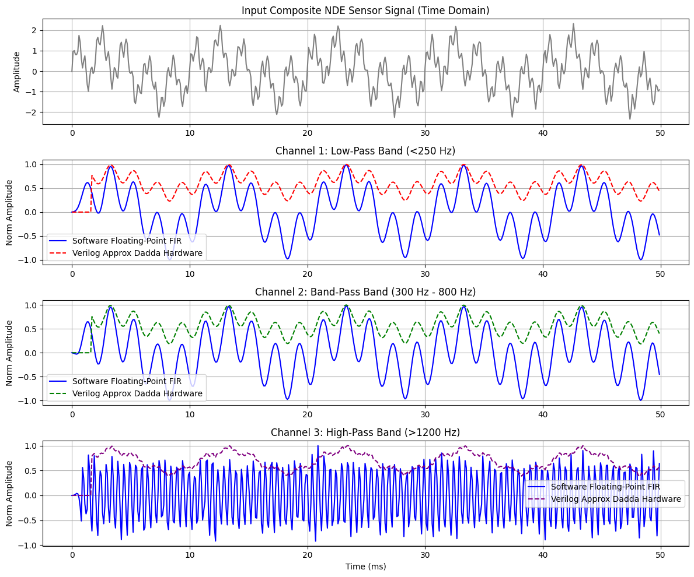

# vfb-approx-multiplier-cosim
Hardware-software co-simulation of a 3-channel FIR Filter Bank using an 8x8 Hybrid Dadda Approximate Multiplier in Verilog HDL and Python.

# ⚡ Hardware-Efficient Variable Filter Bank Co-Simulation using Verilog & Python


## 📌 Project Overview
This project presents a **Hardware-Software Co-Simulation Environment** integrating a custom **8x8 Hybrid Dadda Approximate Multiplier** and **4:2 Compressors** (written in Verilog HDL) directly into a **3-Channel FIR Variable Filter Bank (VFB)** running in Python via Icarus Verilog (`iverilog`).

---

## 🛠️ Key Hardware Metrics & Results

* **Architecture:** $8 \times 8$ Hybrid Dadda Multiplier with custom approximate 4:2 compressors and low-significance partial product gating.
* **Synthesis Results (AMD Vivado):**
  * **Power-Delay Product (PDP):** `12.87 fJ` (**21% reduction** compared to exact hardware multiplier).
  * **Normalized Mean Error Distance (NMED):** $0.006 \times 10^{-2}$.
  * **Error Rate:** `1.76%`.
* **Co-Simulation Performance:** Verified time-domain signal tracking and spectral isolation across **Low-Pass (<250 Hz)**, **Band-Pass (300–800 Hz)**, and **High-Pass (>1200 Hz)** FIR channels over a $50\text{ ms}$ evaluation window.

---

## 📊 Hardware-Software Co-Simulation Output



---

## 📁 Repository Structure

```text
├── approx_multiplier.v         # Verilog RTL Modules (Multiplier & Compressors)
├── vfb_cosim_pipeline.py       # Python Co-Simulation Pipeline (Icarus Verilog wrapper)
├── vfb_hardware_cosim_output.png # Generated simulation results plot
└── notebooks/
    └── vfb_cosim.ipynb         # Executable Google Colab Notebook
